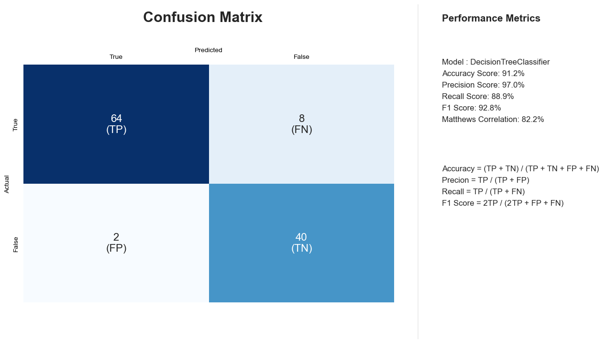

# Awesome Confusion Matrix

I was not satisfied with the visualizations of the confusion matrix I had seen on the internet so I created this code to improved way of viewing the confusion matrix. 

# Confusion Matrix Explanation

## Introduction

In the field of machine learning and statistics, a **confusion matrix** is a tool that allows us to visualize the performance of a classification algorithm. It provides a comprehensive view of the results produced by the algorithm by breaking down the predicted outcomes into categories such as true positives, true negatives, false positives, and false negatives.

## Understanding the Confusion Matrix

A confusion matrix is generally used for evaluating the performance of a binary classification model, but it can also be extended to multiclass classification. It consists of four essential components:

- **True Positives (TP)**: These are the instances that are correctly predicted as positive by the classifier.
- **True Negatives (TN)**: These are the instances that are correctly predicted as negative by the classifier.
- **False Positives (FP)**: Also known as Type I errors, these are instances that are actually negative but are incorrectly predicted as positive.
- **False Negatives (FN)**: Also known as Type II errors, these are instances that are actually positive but are incorrectly predicted as negative.

## Constructing the Confusion Matrix

A confusion matrix is typically presented in a tabular format:

|                   | Actual Positive | Actual Negative |
|-------------------|-----------------|-----------------|
| Predicted Positive|       TP        |       FP        |
| Predicted Negative|       FN        |       TN        |

## Metrics Derived from the Confusion Matrix

Several important metrics can be calculated based on the values in the confusion matrix, which provide insights into the model's performance:

- **Accuracy**: (TP + TN) / (TP + TN + FP + FN)
- **Precision**: TP / (TP + FP)
- **Recall (Sensitivity)**: TP / (TP + FN)
- **Specificity**: TN / (TN + FP)
- **F1-Score**: 2 * (Precision * Recall) / (Precision + Recall)

## Significance

The confusion matrix is an indispensable tool for evaluating the quality of a classification model. It helps us understand how well the model is performing in terms of correctly identifying positive and negative instances. This information is crucial for making informed decisions about model improvements and adjustments.

## Usage

In this repository, you'll find Python code that demonstrates how to generate a confusion matrix using libraries such as NumPy and scikit-learn. The code includes a step-by-step process to calculate the various metrics derived from the confusion matrix.

## Conclusion

Understanding the concepts behind a confusion matrix is essential for anyone involved in machine learning, as it provides a clear picture of the performance of classification models. This README has aimed to provide a concise overview of the key concepts, construction, metrics, and significance of the confusion matrix.
